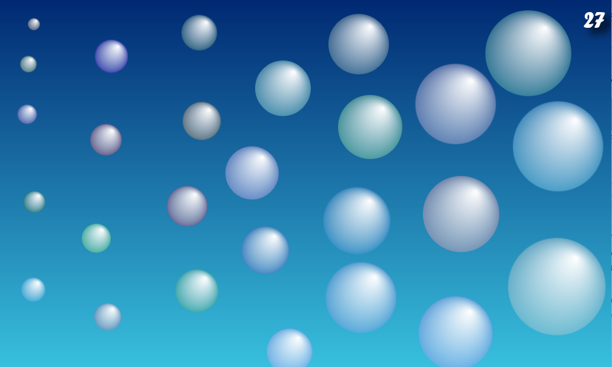

# Bubblez
This is a tiny game which is just a playground for me to learn UWP / WinUI. You can clone it, change the code, play it or do whatever you want. 

## The game
Well this game is really quite simple. Just place as many `Bubblz` as possible on the screen. But be carefull, the `Bubblz` may not touch each other. Over the time the `Bubblz` grow, so the faster you are, the more `Bubblz` you can place. Enjoy :smile:

*Can you do it better? - I'm sure you can :-)*

## Language
Currently the Messages are all in German, but maybe someday I will translate it. 

## Levels
Currently I have just one Level. Maybe I will add more Levels later, maybe not. Good ideas are welcome.

## Highscore
Highscore is analog currently. If you don't remember your score, nobody knows your score

## Libaries I use
I use the great [Windows Community Toolkit](https://github.com/windows-toolkit/WindowsCommunityToolkit) Many thanks to them. 

## License
This software is released under the [MIT License](/LICENSE.md)
